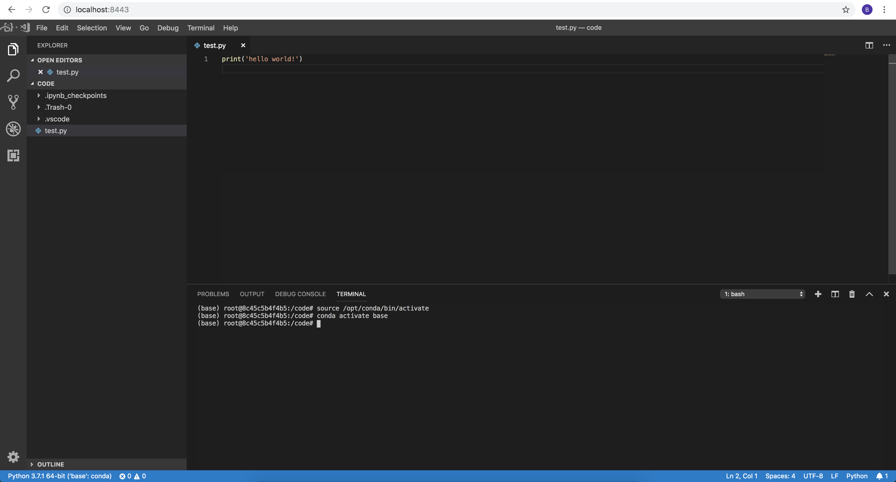

+++
title = "Running VSCode in Docker"
date = 2019-04-04T02:13:50Z
author = "Binal Patel"
tags = ["docker", "ml engineering"]
categories = ["coding"]
+++

#### 2020 Update
A lot has changed since I first wrote this post - as of today I'd recommend you use [VSCode Remote Containers Extension](https://code.visualstudio.com/docs/remote/containers) instead of this. PyCharm has similar functionality as well.

What I normally do now - start up a remote container on a development server running JupyerLab (still using Conda for the Python environment), and attach to it. [These docs](https://code.visualstudio.com/docs/remote/containers) may be useful is you want to do that. I can then port-forward `8888` if I want to use Juypter, or just directly develop within VSCode within the remote container.

#### Original Post

I was excited to learn recently that you can run VSCode within Docker containers, due to the great work from the [Coder](https://coder.com/) team. Up until now I've been running JupyterLab within containers, which - while allowing for quick prototyping, was less than ideal as a full featured IDE. I've updated the Dockerfile's I often use - which now include:

1. Conda - for Python dependencies
2. VSCode - for a full featured IDE
3. JupyterLab - for quick prototyping via notebooks

Here's how I set it up - as before my focus was on setting up a data science environment where I could quickly iterate within the container itself.

#### TLDR

You can find a fully working example here:

https://github.com/caesarnine/data-science-docker-vscode-template

Why is this useful?

1. You can develop all your code in a fully specified environment, which makes it much easier to reproduce and deploy models and analysis.
2. You can (after enabling security) move your IDE to the data. Instead of transferring data back and forth you can develop where your data is stored.
3. Last - and most important for me - in industries like my own (healthcare), you work with highly regulated data that has to be stored securely, where having multiple copies of data on multiple laptops can pose an unacceptably large risk. 

    Running containers like this within a secure environment with access to the data helps us to have an ideal development environment, while ensuring the protected data remains in a secure, single location with no unnecessary duplication.


#### The Details

First - the `Dockerfile`. Here we're setting up our Conda environment, downloading the VScode binary, adding in a `code` folder and a `docker-entrypoint.sh` script. If you've never encountered an entrypoint script before - it essentially is telling Docker that this specific piece of code must always execute when the container starts.

`Dockerfile`:
```docker
 # the base miniconda3 image
 FROM continuumio/miniconda3:latest
 
 # load in the environment.yml file - this file controls what Python packages we install
 ADD environment.yml /
 
 # install the Python packages we specified into the base environment
 RUN conda update -n base conda -y && conda env update
 
 # download the coder binary, untar it, and allow it to be executed
 RUN wget https://github.com/codercom/code-server/releases/download/1.408-vsc1.32.0/code-server1.408-vsc1.32.0-linux-x64.tar.gz \
     && tar -xzvf code-server1.408-vsc1.32.0-linux-x64.tar.gz && chmod +x code-server1.408-vsc1.32.0-linux-x64/code-server
 
 # add in the code folder
 ADD ./code/ /code
 
 COPY docker-entrypoint.sh /usr/local/bin/
 
 ENTRYPOINT ["docker-entrypoint.sh"]
 ```

This is our `docker-entrypoint.sh` script. In summary: if no extra parameters are passed then we start JupyterLab and VSCode, if a parameter is passed than execute that instead. This allows us to do things like develop locally, and when we have a Python script ready just pass in `python our_script.py` without changing anything else.

`docker-entrypoint.sh`:
```docker
#!/bin/bash
set -e

if [ $# -eq 0 ]
  then
    jupyter lab --ip=0.0.0.0 --NotebookApp.token='local-development' --allow-root --no-browser &> /dev/null &
    code-server1.408-vsc1.32.0-linux-x64/code-server --allow-http --no-auth --data-dir /data /code
  else
    exec "$@"
fi
```

After we build the image (`docker build -t example-ds-project .`) we can run it. The following command runs our container, opening up ports 8443 and 8888, and mounts local directories `code` and `data` onto the container as well.

```
docker run -p 8443:8443 -p 8888:8888 -v $(pwd)/data:/data -v $(pwd)/code:/code --rm -it example-ds-project
```

We can then navigate to http://localhost:8443 and we have a fully featured, working version of VSCode:



You can even do things like installing extensions. For example you could install Microsoft's Python extension to enable things like autocomplete and formatting, and so on. All your extensions and VSCode configuration will persist in the local `./data` directory, so when you start up the container again you won't have to set everything up again.

As a plus we still have JupyterLab running on http://localhost:8888, which allows us still prototype quickly via notebooks, while being able to quickly switch over to VSCode when we're ready to clean up and productionalize our code.